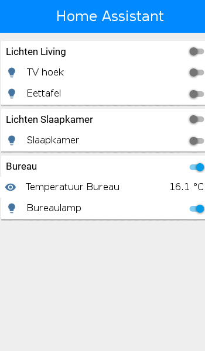
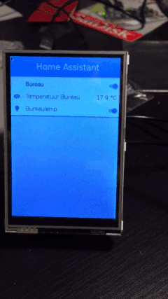

# Homeassistant UI Display
This is a UI for [home-assistant](http://home-assistant.io) i've 
written for own use. It's main purpose is to be able to control
home-assistant from a pi with a touchscreen mounted on the wall.

This project uses [pygame](http://pygame.org) as backed & the awesome
[pgu](https://github.com/parogers/pgu) for the GUI. Using a custom theme
& UI elements, I've tried to mimmick the web ui of home-assistant.

## Screenshot



## features
* displaying group items
* switching on/off of lights
* displaying sensor data
* Uses EventStream (`/api/stream`) for streaming updates
* Using `icon_font_to_png` to use the Material Design Icon font on the fly.
* Cool

## Install
```bash
pip3 install --process-dependency-links .
```
### Why `--process-dependency-links`

To my knowledge, there are no packages for `pygame` and `pgu` in PyPi for
python3.

This option uses the `dependency_links` in `setup.py` for getting the tar.gz
files from their repos. It's nasty, I know. Can't help it!


Side note: The raspberry pi repos contain a pygame package for python3!

## Configuration

HUD needs a configuration file, ini-style. For Example:

```ini
[HomeAssistant]
Host = localhost
Port = 8123
Key = my-secret-password
SSL = False
[lights]
group=lichten_living
```

The first one speaks for itself, home assistant configuration.

The second one is a group definition. it needs an group entity name
(for ex. if you have `group.lichten_living` enter `lichten_living`)
There can be as many sections as you want, if you have at least one
HomeAssistant section.


Enjoy!

## Disclamer

Don't look at the code, it's ugly! You're always welcome to post a pull request
to make the code cleaner, or just give me some pointers. I love to learn more!
